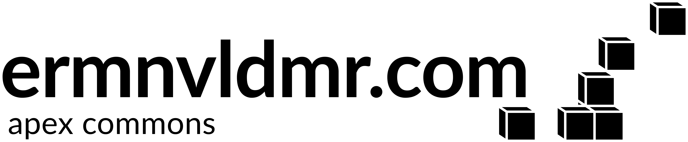

<p align="center">
  
</p>

# apex.ermnvldmr.com commons

apex helps you run a bunch of self-hosted apps across a few machines — a VPS here, a home server
there — and keep them consistent, reproducible, and under version control. Instead of hand-tuning
every box and copy-pasting compose files around, you describe each machine once in its own git
repository, share a common set of conventions and building blocks between them, and manage the
whole thing with one small command: `apex`.

It's for the person who self-hosts a handful of mostly-unrelated things — a media server, a
password vault, a mail server, some *arr apps — and wants the fleet to feel like one tidy,
git-tracked system instead of a pile of snowflakes.

## Why

Self-hosting across a few boxes tends to sprawl. Every host slowly becomes a one-off,
configuration drifts away from whatever you last wrote down, and "how did I set this up again?"
turns into a recurring question. apex keeps the shared parts in one versioned place and every host
as a plain, reviewable git repo — so your setup is something you can read, diff, and rebuild, not
something you hope you still remember.

A few things that keep it pleasant to live with:

- **No control plane.** Nothing central to run or babysit — every command acts on the machine you
  run it on. The "fleet" is just a set of repositories that share the same building blocks.
- **No lock-in, no build step.** Just `git` and Python's standard library — no pip, Node, Go, or
  code generation. The compose files are hand-written and stay readable.
- **Assumes nothing about your setup.** A machine says who it is in a small `node.env` file; apex
  makes no assumptions about your domain, hosting provider, or topology.

## How it works

- **Each host is a git repository** that pins apex as a shared `commons/` submodule, then adds its
  own `compositions/` (the services that host runs) and `proprietaries/` (anything special to that
  host).
- **One command, grouped actions.** You drive everything with `apex <group>/<action>` — the path
  *is* the name (`configure/ufw`, `compose up`, `sync/repository`, …). A host can override or
  extend any shared action with its own, through a small overlay.
- **A shared compose core** gives every host the same foundation — an edge reverse proxy (Traefik)
  and a Docker-socket proxy — plus opt-in pieces you switch on per host: AdGuard, an Xray edge, a
  Grafana Alloy metrics/logs agent, and label-driven `restic` backups.
- **Your setup captures itself.** A scheduled "capture-up" records each host's live state back into
  its repo on a `sync/<node>` branch, so drift shows up as a diff you can review.

Under the hood it's deliberately boring: a `python3`-stdlib engine that resolves the overlay, works
out the host's identity, builds a context of helpers, and hands it to your action.

📖 **[Read the docs](https://docs.ermnvldmr.com/en/apex/)** for the full picture — concepts, guides,
and reference — also available in [Russian](https://docs.ermnvldmr.com/ru/apex/).

## Quick start

Every host is its own git repository that pins apex. Bringing up a host called
`selfhost.example.com` looks like this:

```sh
# Get the host's repo (it pins apex as commons/) and put `apex` on your PATH
git clone --recurse-submodules git@github.com:you/selfhost.example.com.git
cd selfhost.example.com && ./init.sh && source ~/.bashrc

# Tell apex who this host is
cat > node.env <<'EOF'
APEX_NODE_FQDN=selfhost.example.com
APEX_NODE_HOST=selfhost.example.com
APEX_SUBNET=198.18.16.0/24
EOF

apex configure        # set the host up: firewall, crowdsec, cron, systemd, routing
apex compose up       # bring its services online
```

A couple of steps sit in between on a real host — linking storage, provisioning users, filling in
secrets. The **[Getting started guide](https://docs.ermnvldmr.com/en/apex/getting-started/)** walks
through the whole thing.

## Requirements

- `git` and `python3` — standard library only, nothing to install.
- A Debian-based host with Docker and `docker compose` v2.

## License

BSD-2-Clause — see [`LICENSE`](LICENSE).

---

Portions of this project's source code may have been developed with the assistance of AI
code-generation tools. Contributions made with the help of such tools are welcome, provided the
code quality stays within an acceptable range and the contributor fully understands the submission
they are making.
